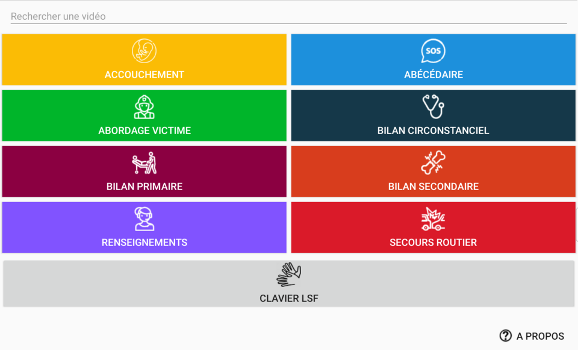
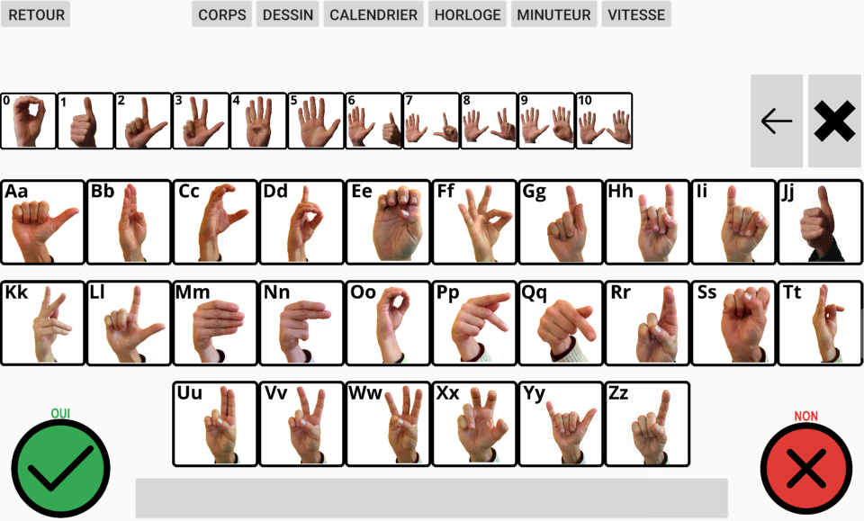
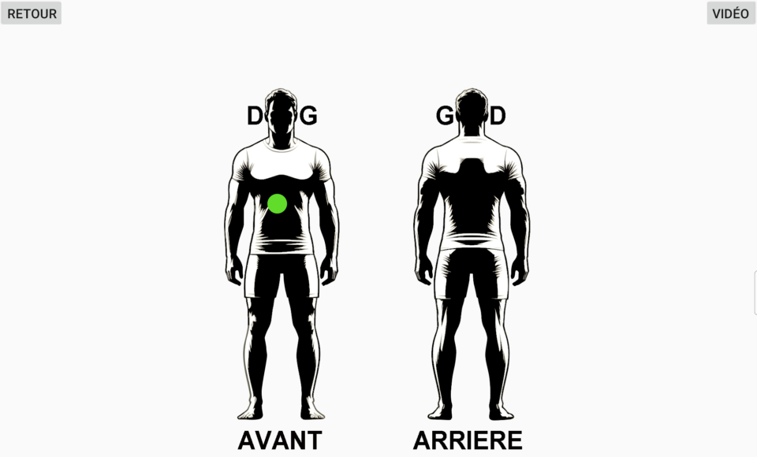
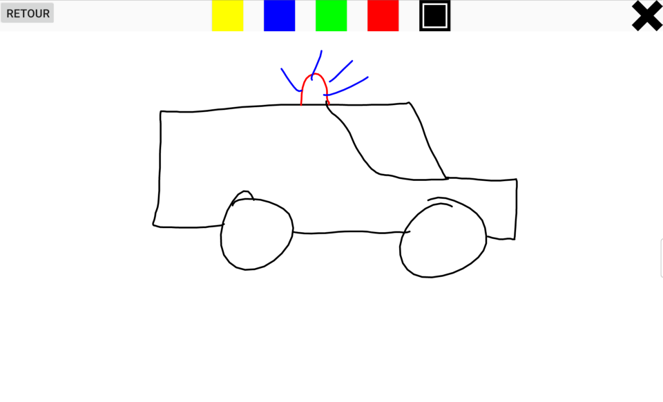
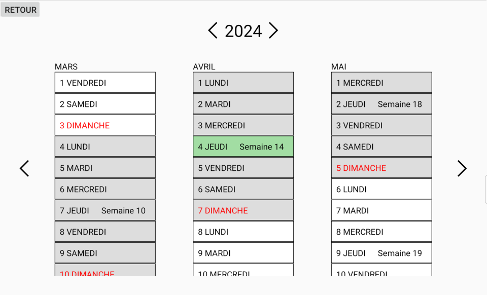
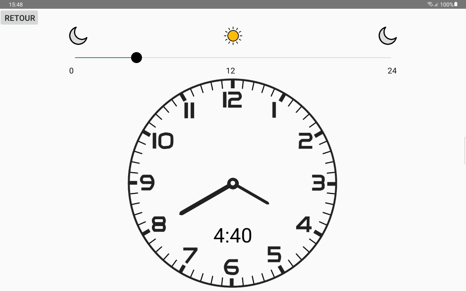
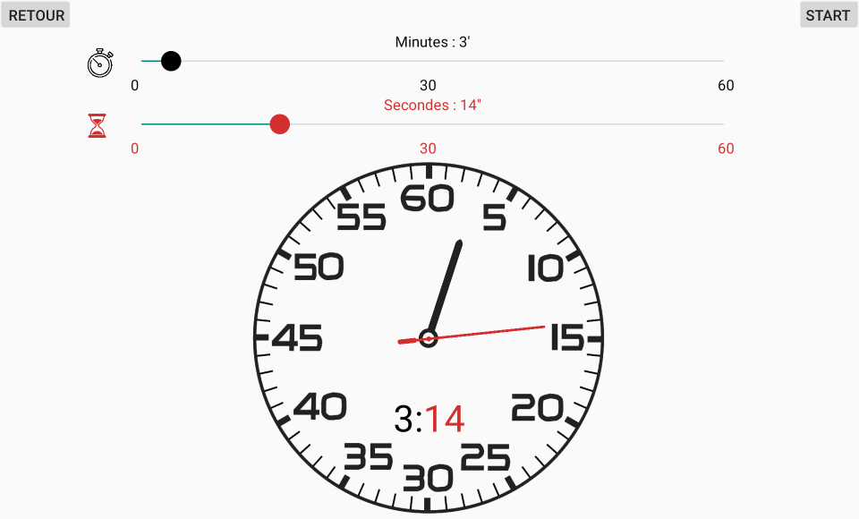
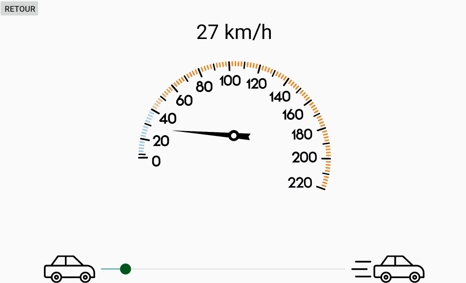

## SECOURS LSF
------------

L'application Android SECOURS LSF a pour principal objectif de faciliter la communication entre les
services de secours, tels que les pompiers, SAMU et la police, et les personnes sourdes et mal entendantes
lors de leurs interventions en utilisant des vidéos et des images. Elle vise principalement à servir
les professionnels de secours.

## Fonctionnalités
------------

L'application permet plusieurs actions :

* La lecture de vidéos spécifiques en fonction de la nature de l'intervention.

  

* La saisie de texte à l'aide d'un clavier adapté au langage des signes.

  

* Le placement de repères sur une silhouette pour indiquer précisément la zone du corps humain où
  une douleur ou une plaie est présente.

  

* Une zone de dessin libre pour pouvoir expliquer une situation par un dessin.

  

* Un calendrier afin de répondre a des questions demandant une date.

  

* Une horloge et un minuteur permettant de répondre a des questions avec une notion de temps ou de
  durée.

  
  

* Un compteur de vitesse permettant de montrer la vitesse d'un véhicule.

  

## Prérequis
------------

- Version SDK recommandée : 36

* ![Android16]

- Version SDK minimum : 24

* ![Android7]

## Technologies
------------

Langages :

* ![Java]
* ![Kotlin]
* ![HTML]

## Auteurs
-------

- Ludovic Tournier (développeur)
- Andy Tkaczyk (responsable produit)

## YouTube
-------

Lien vers les videos YouTube de l'application.

## Play Store
-------

Lien vers le Play Store de Google permettant de télécharger l'application gratuitement.

## Licence
-------

Cette application est publiée sous CC BY-NC-ND 4.0 DEED. Voir ci-joint à la racine du
projet [LICENSE](LICENSE.md)

## Législation
-------

* Politique de confidentialité [PDC](PDC.md)
* Conditions générales d'utilisation [CGU](CGU.md)

[Kotlin]: https://img.shields.io/badge/Kotlin-6A43C4?link=https%3A%2F%2Fkotlinlang.org%2F

[Java]: https://img.shields.io/badge/Java-F29111?link=https%3A%2F%2Fdev.java%2F

[HTML]: https://img.shields.io/badge/HTML-e34c26

[Android7]: https://img.shields.io/badge/Android7-4FC3F7?link=https%3A%2F%2Fdeveloper.android.com%2Fabout%2Fversions%2Fnougat%2Fandroid-7.0

[Android16]: https://img.shields.io/badge/Android16-016c36?link=https%3A%2F%2Fdeveloper.android.com%2Fabout%2Fversions%2F16%2Fget%3Fhl%3Dfr
